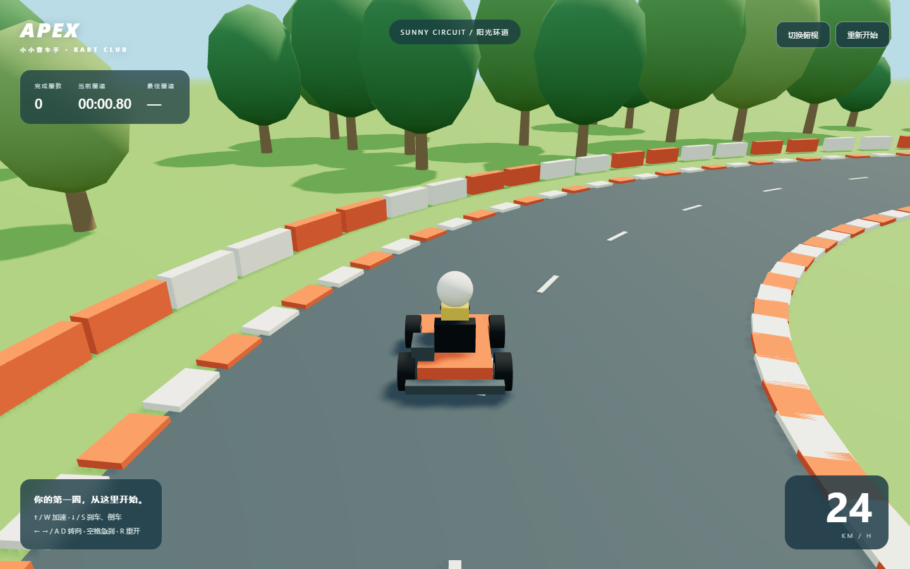
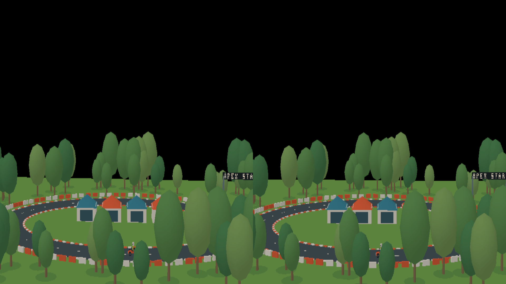
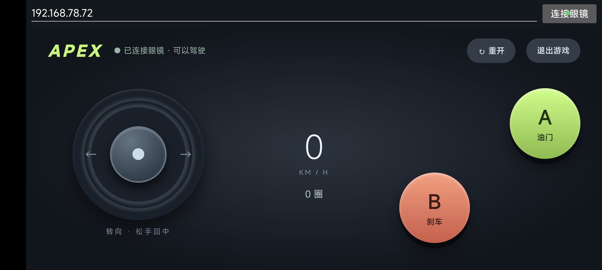

# APEX XR Kart

Android OpenXR 卡丁车与局域网手机手柄。

- `xr-test-sdk/src/tests/hello_xr`：眼镜端，基于 Khronos OpenXR-SDK-Source release-1.1.36，保留上游许可。
- `xr-test-sdk/controller`：手柄页面、音效和音乐。页面内嵌至 `controller_page.h`，修改页面后需同步生成该头文件。
- `phone-remote`：Android 手机手柄壳、UDP 自动发现、配对。
- `kart`：原始 Three.js 赛道与资产生成脚本。

## 构建
安装 JDK 21、Android SDK 35、NDK 25.1.8937393、CMake 3.22.1，设置 JAVA_HOME 和 ANDROID_HOME。

```powershell
./kart/android/gradlew.bat -p xr-test-sdk/src/tests/hello_xr assembleOpenGLESDebug
./kart/android/gradlew.bat -p phone-remote assembleDebug
```

生成赛场资产：在 kart 下执行 npm ci，然后在仓库根目录执行 `node kart/export-xr.mjs`。

眼镜需要兼容的 InmoXR Runtime（GLES/arm64）；运行时工程不包含在此仓库。
两端连同一可信局域网。眼镜打开游戏后，手机自动发现或手动输入 IP；首次输入眼镜场景中的六位配对码。
服务端口：HTTP 8088、UDP 8089。当前原型通信未加密。

眼镜端版本1.5、手机端0.4。包含双目6DoF、前进倒车、氮气续时和粒子、手柄声音、自动发现及配对。物理手感和自动发现仍需不同设备网络下测试。

本目录不含设备日志、截图、签名密钥、安装包或用户Runtime源码。

## 画面预览

以下为开发过程中保存的截图，部分界面可能早于当前版本。

### 网页版赛道


### 眼镜端双目渲染
左右两幅分别对应双眼画面；普通屏幕截图无法展示佩戴眼镜时的立体感与现实背景。


### 手机手柄


## 开源许可

本项目原创代码采用 MIT 许可，见 [LICENSE](LICENSE)。`xr-test-sdk` 基于 Khronos OpenXR-SDK-Source；上游代码及第三方组件继续遵循各自文件中的 SPDX 声明和原有许可，MIT 许可不替代这些许可。
